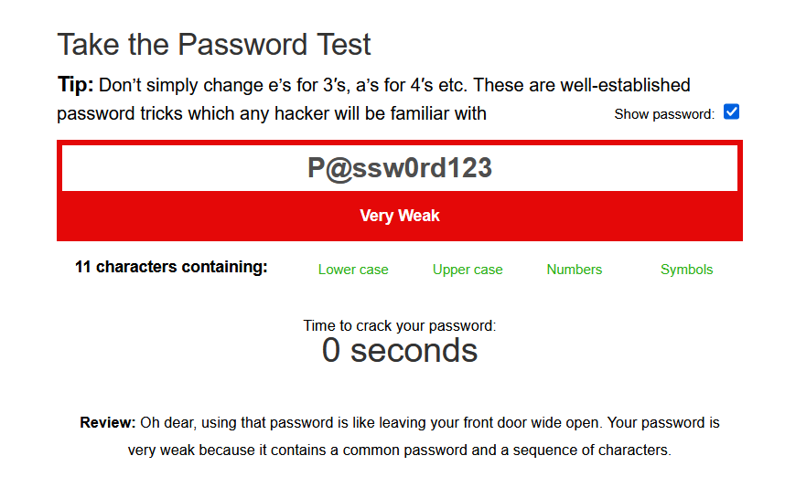
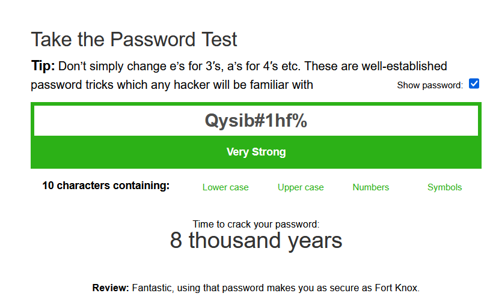
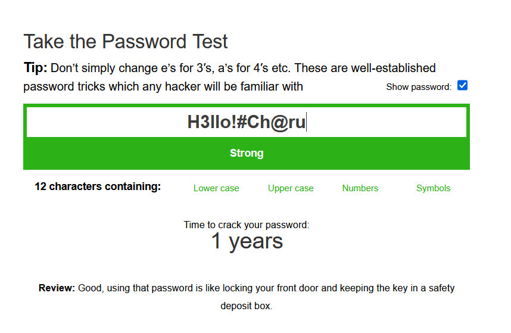

# password-strength-task6
Cybersecurity Internship Task 6 – Password Evaluation Report
# 🔐 Cyber Security Internship - Task 6: Password Strength Evaluation

---

## 📌 Objective

Evaluate multiple passwords using online strength tools to understand what makes a secure password and how to protect against common attacks.

---

## 🧪 Password Strength Tests

| Password         | Strength     | Time to Crack   | Tool Feedback |
|------------------|--------------|------------------|----------------|
| `P@ssw0rd123`     | ❌ Very Weak   | 0 seconds         | Too common and predictable. |
| `charu1421`       | ⚠️ Medium      | 8 days            | Name-based and short. |
| `Charu$1421`      | ✅ Strong      | 2 months          | Good complexity, needs randomness. |
| `H3llo!#Ch@ru`    | ✅ Strong      | 1 year            | Good length and variety. |
| `Qysib#1hf%`      | 🟢 Very Strong | 8,000 years       | Excellent randomness and complexity. |

---

## 📸 Screenshots

### 🔻 Very Weak Password Example

### 🔻 Very Strong Password Example

### 🔻 Strong Password Example

---

## 🔍 Best Practices Learned

- Use **12+ characters**
- Mix **uppercase**, **lowercase**, **numbers**, and **symbols**
- Avoid **dictionary words**, names, or predictable phrases
- Use **random strings** or **secure passphrases**
- Store passwords using a **password manager**
- Never reuse passwords between sites

---

## 🛡️ Common Attack Methods

| Attack Type         | Description |
|---------------------|-------------|
| **Brute-force**     | Attempts every combination. Longer passwords resist this. |
| **Dictionary**      | Tries known words and variants. Avoid real words. |
| **Credential Stuffing** | Tries leaked passwords from other breaches. |
| **Phishing**        | Social engineering to steal passwords. |

---

## ✅ Summary

> The strongest password in the test (`Qysib#1hf%`) could resist cracking for over **8,000 years**, while the weakest (`P@ssw0rd123`) would be broken **instantly**.

---

## 🔗 Tools Used

- [Password Strength Meter ](https://www.passwordmonster.com/)

---

## 🧾 License

This project is released under the [MIT License](LICENSE).

